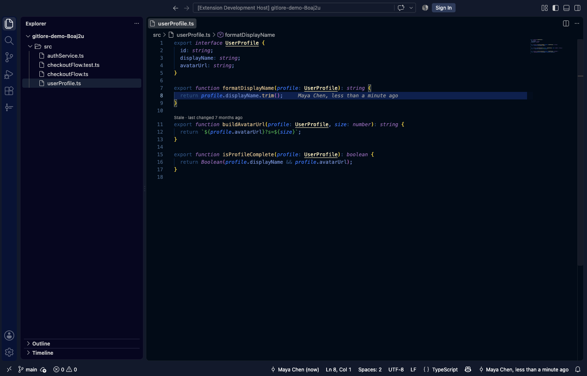
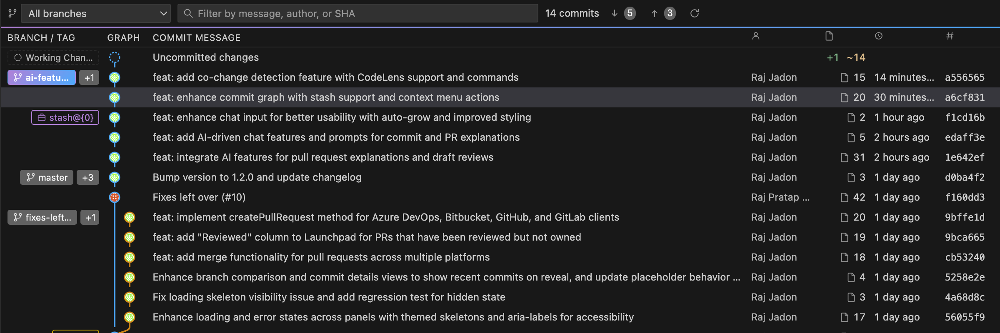
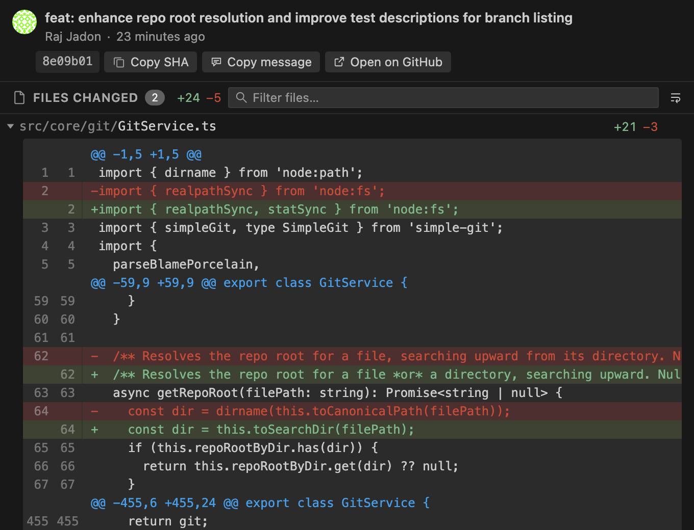
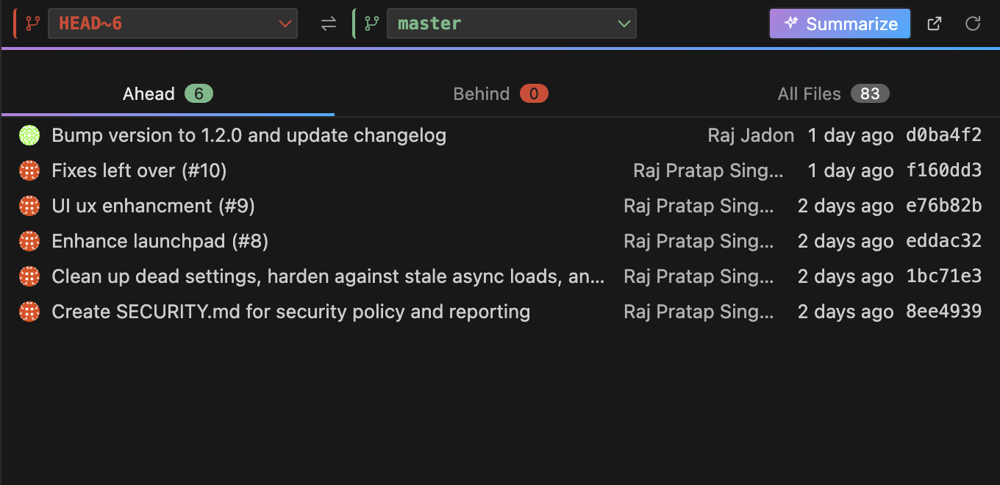

<div align="center">


# GitLore

**The story behind every line.**

Free, local-first git insight inside VS Code — blame, history, an interactive commit graph,
and branch comparison. No account, no paywall, no telemetry, no backend.

</div>

---

## What is this?

Open any file in any git repo and GitLore answers the question you actually have: **who wrote this line, when, why, and what else changed with it.**

It does that without leaving your editor, without signing in, and without sending your code anywhere. Everything runs against the `git` binary already on your machine.

If you've used GitLens, GitLore covers the same core ground — inline blame, a commit graph, commit details, branch comparison — with every feature free and a deliberately smaller surface area. See [How it compares](#how-it-compares).

> **Status: early but stable-channel.** Everything below works and is covered by tests — 207 unit tests and 32 integration tests against a real VS Code instance. It is still `0.x`, so expect breaking changes before `1.0`. Bug reports are very welcome.

## Install

**From the Marketplace** — search *GitLore* in the Extensions view (`⇧⌘X` / `Ctrl+Shift+X`) and click Install. Or from the command line:

```bash
code --install-extension RajpratapsinghJadon.gitlore
```

**From a `.vsix`** — grab one from [Releases](https://github.com/rajjadon/gitlore/releases), then:

```bash
code --install-extension gitlore-0.2.0.vsix
```

Requires **VS Code 1.85+** and `git` on your `PATH`. Works in Cursor and other VS Code-based editors.

## Getting started in 60 seconds

1. **Open a file in a git repo.** The current line's author and age appear at the end of the line, and in the status bar.
2. **Hover that line** for the full commit message, dates, and the diff stat.
3. **Open the panel** — `⌘J` / `Ctrl+J`, then pick the **GitLore** tab (next to Terminal and Output). The commit graph loads itself.
4. **Click any commit row.** Its details load in the pane beside the graph — every changed file, collapsible, with a real diff gutter.
5. **Everything else is a button** in each view's title bar. You never need the command palette.

## Features

### Inline blame, where you're already looking



The current line's author and age, as a muted end-of-line decoration. It updates when you change lines — not on every cursor move — and the hover card adds the full message, relative *and* absolute dates, that commit's diff stat for this file, and the short SHA. Customise the text with `gitLore.blame.format`, or turn it off entirely.

### An interactive commit graph, in the panel



A repo-wide, branch-and-merge-aware graph — not a flat log. Branch, tag and remote-tracking labels are each styled distinctly, uncommitted work is pinned at the top as a **Working Changes** row, and the toolbar lets you scope to one branch, filter by message/author/SHA as you type, and refresh. Arrow keys move the selection; Enter opens the commit.

### Commit details you can act on



Each changed file is its own collapsible section holding only that file's hunks, with a filter box for large commits. Diffs show **old and new line numbers in a gutter** and tint changed lines, so you can see *which* line moved — and line numbers stay out of your text selection, so copying a diff gives you just the code.

**Copy SHA**, **Copy message**, and **Open on GitHub/GitLab/Bitbucket** sit in the action bar. **Open changes** on any file row hands off to a real diff editor when you want syntax highlighting and folding.

### Branch comparison without modal prompts



Two ref pickers with a swap button, and **Ahead / Behind / All Files** tabs with counts. It opens on your current branch versus its upstream, so it's useful immediately — retarget either side in place. Diffs are taken against the merge-base, matching what a GitHub or GitLab pull request shows you.

### Also

- **File history** — every commit that touched the current file, following renames, in the Explorer.
- **Issue and PR links** — `#123` in a commit message becomes a link, auto-detected from your remote or pointed at any tracker (Jira included) via a regex and URL template.
- **Stale-code detector** — a CodeLens above functions and methods untouched for longer than `gitLore.staleThresholdDays`, linking straight to the commit that last changed them.

## Commands

Every command is also a title-bar button in the GitLore panel.

| Command | What it does |
|---|---|
| `GitLore: Open Commit Graph` | Reveal the panel and load the repo's graph |
| `GitLore: Show Commit Details` | Load a commit into the details pane |
| `GitLore: Compare Branches` | Compare two refs, ahead/behind/files |
| `GitLore: Show File History` | List commits touching the current file |
| `GitLore: Toggle Inline Blame` | Turn the end-of-line decoration on or off |
| `GitLore: Copy Commit SHA` | Copy a commit's full SHA (from a commit's context menu) |

## Settings

| Setting | Type | Default | Description |
|---|---|---|---|
| `gitLore.blame.enabled` | boolean | `true` | Show inline blame decorations, hover cards, and the status bar item. |
| `gitLore.blame.format` | string | `"{author}, {age}"` | Template for the inline blame text. Tokens: `{author} {age} {date} {message} {sha}` |
| `gitLore.blame.highlightCurrentLine` | boolean | `true` | Highlight the current line's blame decoration. |
| `gitLore.blame.ignoreWhitespace` | boolean | `true` | Pass `-w` to git blame to ignore whitespace-only changes. |
| `gitLore.maxBlameFileSize` | number | `1048576` | Skip blame for files larger than this size, in bytes. |
| `gitLore.maxHistoryItems` | number | `200` | Max commits loaded per file history. |
| `gitLore.maxGraphItems` | number | `200` | Max commits loaded in the commit graph. |
| `gitLore.staleCode.enabled` | boolean | `true` | Show a CodeLens above functions and methods that haven't changed in longer than staleThresholdDays. |
| `gitLore.staleThresholdDays` | number | `180` | Days since a function's or method's last change before it's flagged as stale. |
| `gitLore.issueLinking.enabled` | boolean | `true` | Auto-link issue/PR references in commit messages. |
| `gitLore.issueLinking.pattern` | string | `"#(\\d+)"` | Regex matching issue references. The first capture group (or the whole match) fills `{issue}` in the URL template. |
| `gitLore.issueLinking.urlTemplate` | string | `""` | `{issue}`-templated issue URL. Empty = auto-detect from the repo's GitHub/GitLab remote. |

## Privacy

GitLore runs entirely locally. Your git data never leaves your machine.

The one network request it makes on its own: author avatars from `gravatar.com`, keyed by an MD5 hash of the commit email — that's Gravatar's own lookup spec, not a security-relevant use of the hash.

Two things open your browser, and only when you click them: **Open on GitHub/GitLab/Bitbucket**, and issue links. Both URLs are built locally from your `origin` remote; GitLore doesn't contact the host to construct them.

No telemetry. No analytics. No account.

## How it compares

GitLore is not trying to out-feature GitLens — it's trying to be the free, fast, small part you actually use every day. Honest accounting:

**What GitLore does** — inline blame and hover, status bar, file history, commit graph, commit details with per-file diffs, AI commit summaries, AI line explanations, branch comparison, issue linking. All free, forever.

**What it deliberately doesn't** — staging, stashing or committing (that's VS Code's own Source Control view, and the graph links you there), and anything behind a sign-in.

**What's missing for now** — a file-tree view of changed files, and graph auto-refresh. See the [changelog](CHANGELOG.md) for the current list.

## Contributing

```bash
npm install
npm run watch     # rebuild on change
npm run lint      # eslint + tsc --noEmit
npm run test      # unit + integration
```

Press `F5` to launch the Extension Development Host with GitLore loaded.

- `npm run test:unit` runs just the fast, VS Code-free tests over `src/core` and the renderers.
- `npm run package` builds a `.vsix`; `npm run package:pre` builds a pre-release one.
- `npm run icon` re-renders `media/icon.png` from `media/icon.svg` (needs `rsvg-convert`).

Architecture, conventions and the roadmap live in [`CLAUDE.md`](CLAUDE.md). The short version: `src/core/` is pure logic with zero `vscode` imports and is unit-tested in isolation; everything VS Code-facing sits in `providers/`, `views/` and `commands/`.

## License

[MIT](LICENSE) — free, forever, no exceptions.
